

  

A beautiful, privacy-friendly music player for Android, built around your local library.

  
  
  
  
  
  
  

---

## About

Sonora is a local-first music player designed to keep your music experience focused and personal.

It scans the music stored on your device, organizes your collection into songs, albums, artists and playlists, and provides a modern Android playback experience without turning the app into a streaming service.

## Screenshots

### Getting Started

  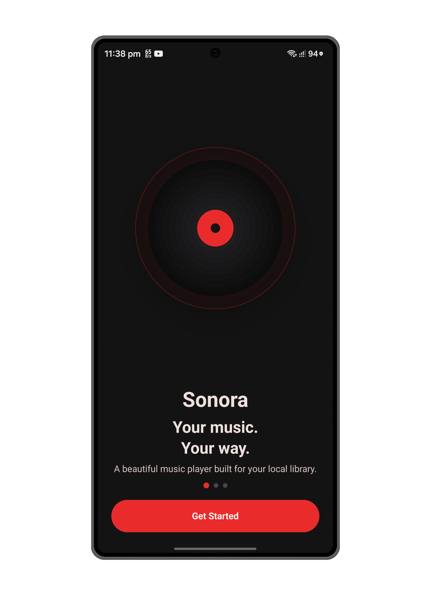
  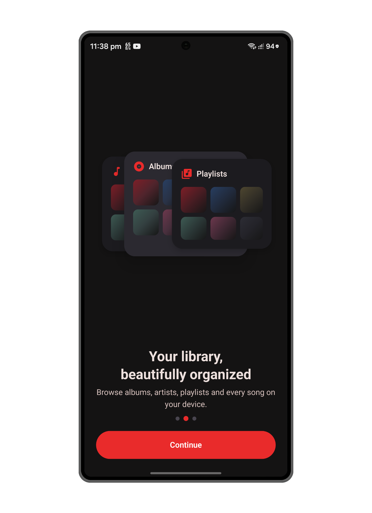
  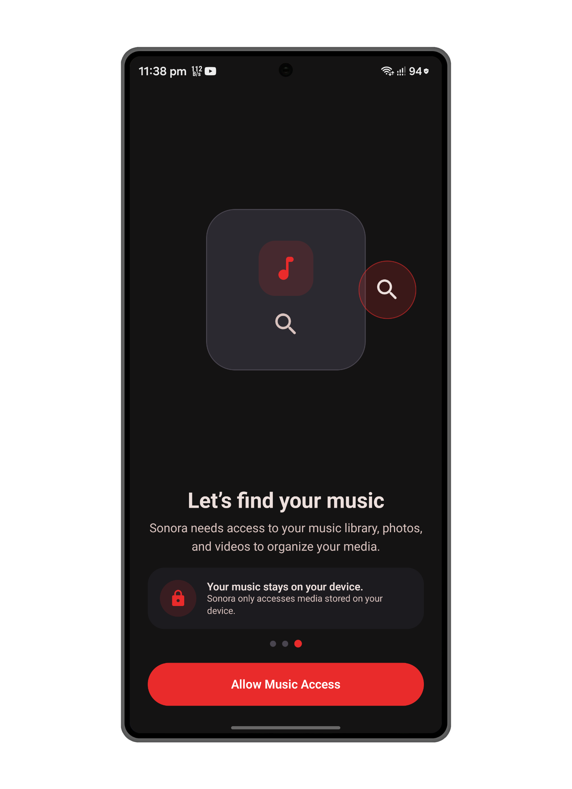

### Library

  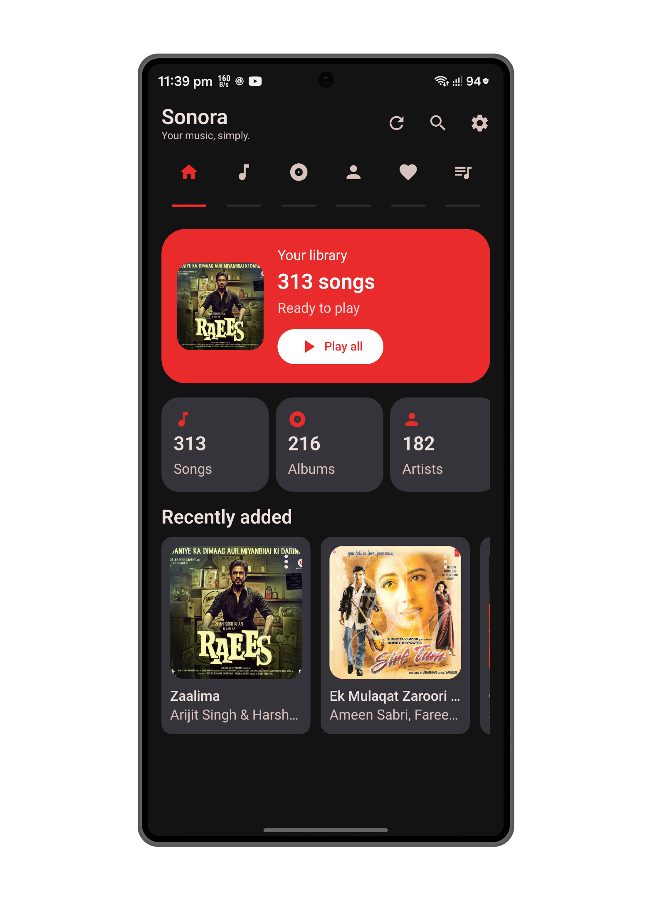
  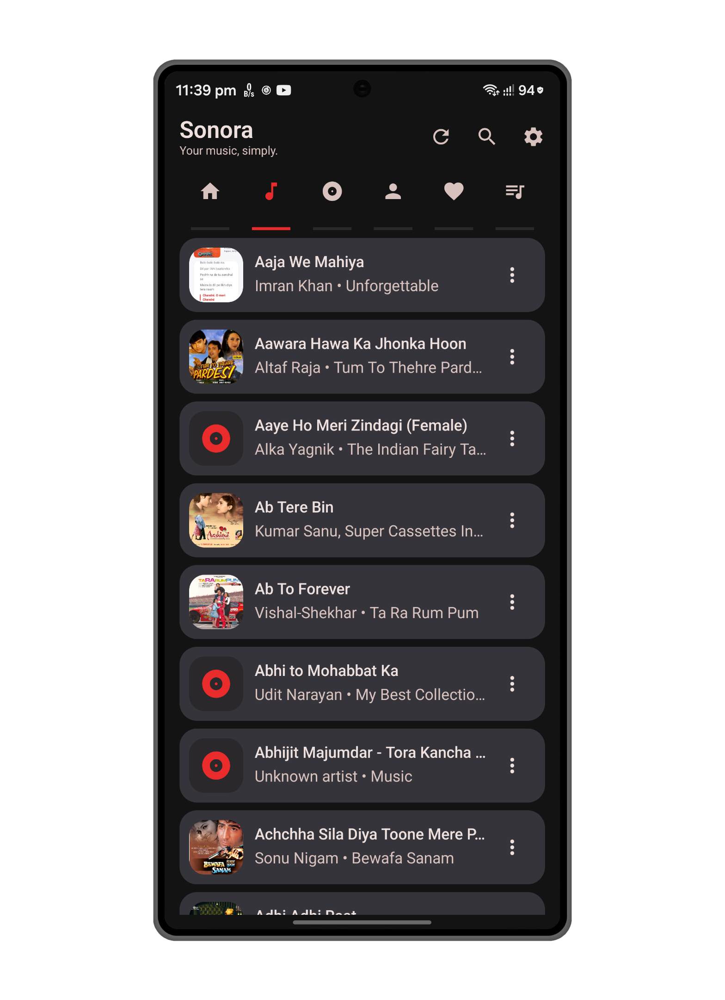
  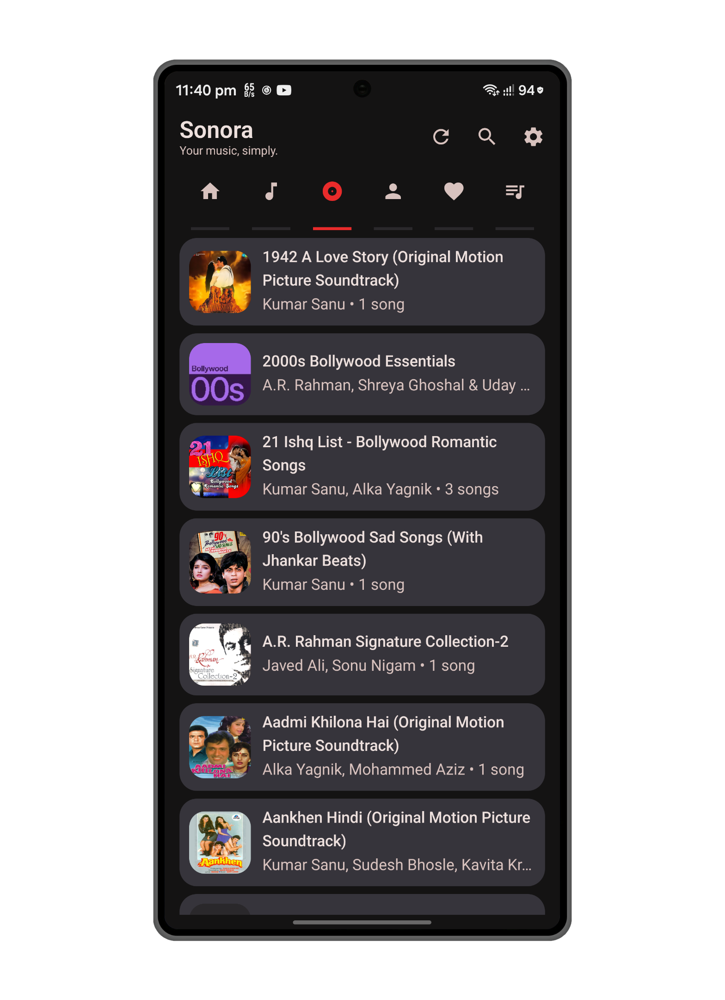

  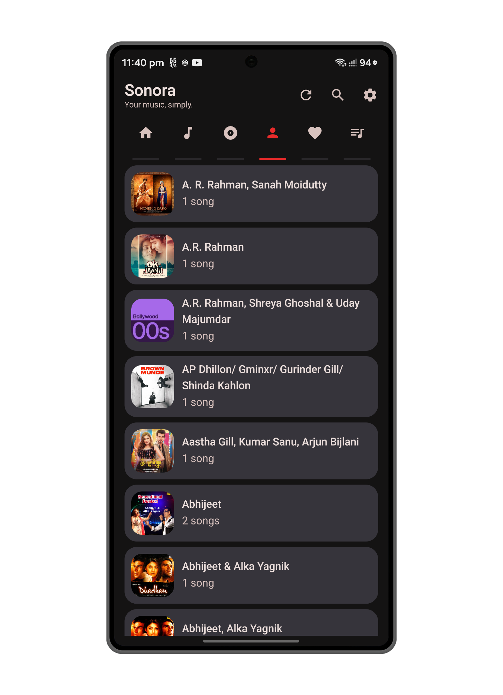

### Playback

  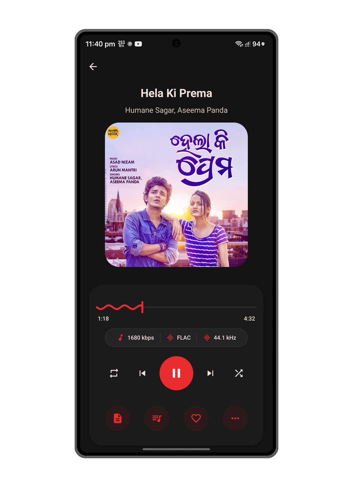
  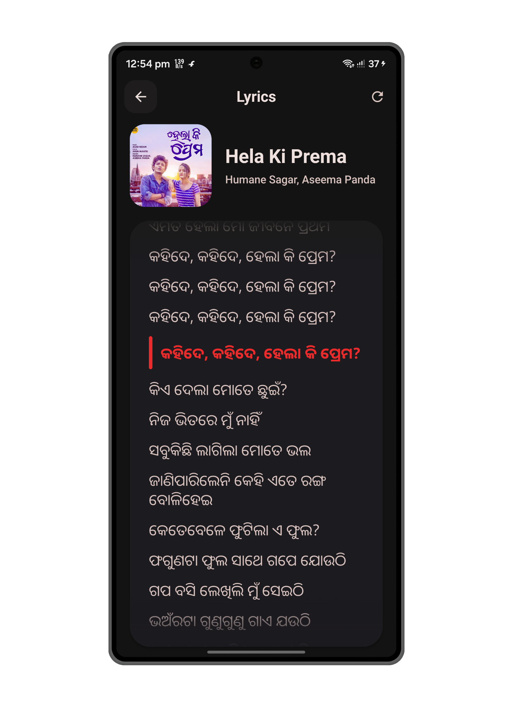

### Personalization

  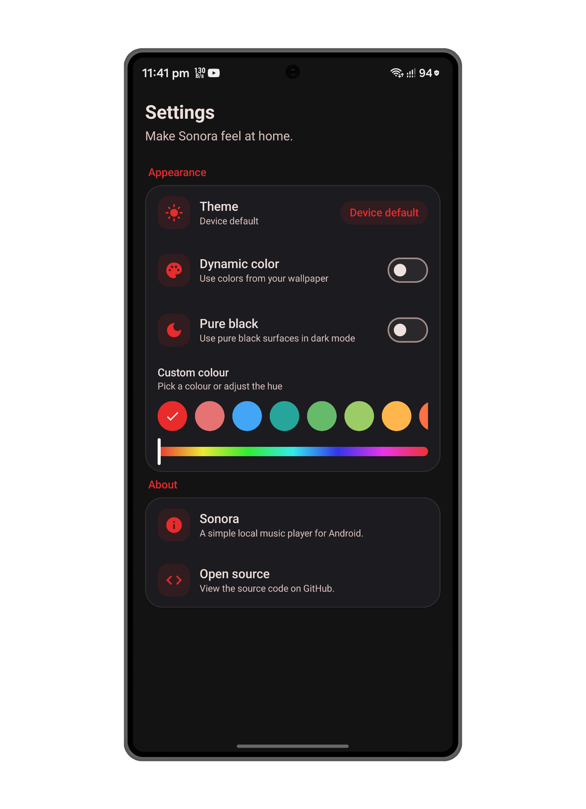
  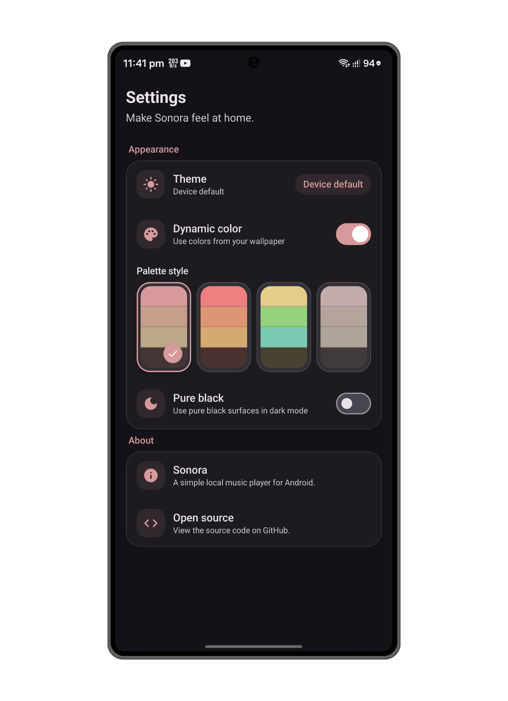
  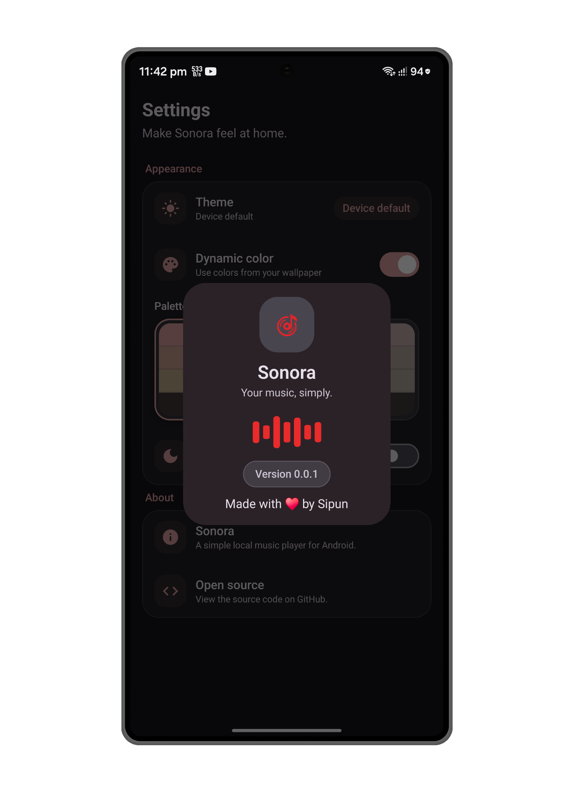

---

## Features

### Local Library

- Scan and browse music stored on the device
- Songs, albums and artists
- Album and artist detail pages
- Playlists and favorites
- Album artwork and local metadata
- Recently added music

### Playback

- Play, pause, previous and next
- Queue management
- Shuffle and repeat modes
- Seeking with an expressive playback control
- Playback speed control
- Background playback
- Android system media controls
- Media notification
- Audio format information

### Lyrics

- Dedicated lyrics playback surface
- Synced lyric highlighting
- Lyrics retrieval through LRCLIB
- Local playback-aware lyrics presentation

### Metadata

- View local track metadata
- Edit supported music metadata
- Album artwork and track information

### Personalization

- Device theme
- Dynamic color
- Palette and accent customization
- Hue adjustment
- Pure black dark mode

### Android Integration

- Media3-based playback service
- Background playback
- System media controls and notifications
- WorkManager-based update flow
- First-launch onboarding and media permission flow

---

## Downloads

Get the latest available Sonora build from [**GitHub Releases**](https://github.com/Darkstar085/Sonora/releases/latest).

For development builds, clone the repository and build the debug APK locally using the instructions below.

---

## Design

Sonora is built with **Jetpack Compose**, **AndroidX**, and **Material 3 / M3 Expressive**.

The UI is designed around:

- Large, readable typography
- Clear visual hierarchy
- Expressive color and dynamic theming
- Rounded Material surfaces
- Simple, predictable navigation
- Responsive playback controls
- Theme-aware components
- Android-standard interaction patterns

The core interface does not depend on a third-party UI framework.

### Inspiration

Sonora's design and UI direction is inspired in part by [Gramophone](https://github.com/FoedusProgramme/Gramophone), particularly its clean music-player experience, Material-oriented interface, and focus on following Android's platform conventions.

Sonora is an independent implementation built with its own architecture, visual language, and feature set.

---

## Tech Stack

| Area | Technology |
| --- | --- |
| Language | Kotlin 2.4.10 |
| UI | Jetpack Compose |
| Design | Material 3 / M3 Expressive |
| Android foundation | AndroidX |
| Navigation | Navigation Compose 2.10.2 |
| Playback | AndroidX Media3 1.11.1 |
| Background work | WorkManager 2.11.2 |
| Image loading | Coil 3.6.3 |
| Lyrics | LRCLIB |
| Metadata | JAudioTagger 3.0.1 |
| Serialization | Kotlinx Serialization 1.11.0 |
| Build | Gradle + AGP 9.4.0 |
| Java | Java 17 |
| Minimum Android | Android 10 / API 29 |
| Compile / Target | Android API 37 |

---

## Project Structure

~~~text
app/
└── src/
    ├── main/
    │   ├── kotlin/com/sipun/sonora/
    │   │   ├── core/
    │   │   ├── data/
    │   │   │   ├── lyrics/
    │   │   │   ├── media/
    │   │   │   └── preferences/
    │   │   ├── domain/
    │   │   ├── feature/
    │   │   │   ├── album/
    │   │   │   ├── artist/
    │   │   │   ├── favorites/
    │   │   │   ├── home/
    │   │   │   ├── library/
    │   │   │   ├── lyrics/
    │   │   │   ├── nowplaying/
    │   │   │   ├── playlists/
    │   │   │   └── settings/
    │   │   ├── navigation/
    │   │   ├── player/
    │   │   └── ui/
    │   │       ├── onboarding/
    │   │       └── theme/
    │   └── res/
    ├── test/
    └── androidTest/
~~~

The project is organized around feature-focused Compose UI, shared AndroidX/data layers, and a dedicated playback layer.

---

## Building

Clone the repository:

~~~bash
git clone https://github.com/Darkstar085/Sonora.git
cd Sonora
~~~

Open the project in Android Studio and let Gradle sync.

For a debug build:

~~~bash
./gradlew assembleDebug
~~~

The release build is minified and resource-shrunk. Release signing is configured through environment variables:

~~~text
ANDROID_KEYSTORE_FILE
ANDROID_KEYSTORE_PASSWORD
ANDROID_KEY_ALIAS
ANDROID_KEY_PASSWORD
~~~

After configuring the signing credentials, build the release APK with:

~~~bash
./gradlew assembleRelease
~~~

---

## Privacy & Network

Sonora follows a **local-first** approach: your music library and playback are centered around media stored on your device, and no streaming account is required.

The app does use network access for specific features, including:

- Lyrics retrieval from LRCLIB
- Update-related functionality

Media permissions are requested according to the Android version and the features used by the app. The music library permission is required for Sonora to discover and organize local music.

---

## License

Sonora is released under the **MIT License**.

See [LICENSE](LICENSE) for the full license text.

---

**Sonora — Your music, simply.**

Made with ❤️ for local music.

